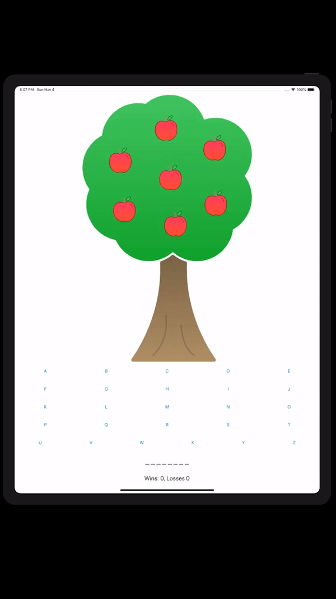

# ApplePie

### Apple Pie App from iBooks

###### It's a simple word-guessing game, each player has a limited number of turns to guess the letters in a word. Each incorrect guess results in an apple falling off the tree. The player wins by guessing the word correctly before all the apples are gone. Made for iPad only. 

###### I used the following to make this app:

+ `buttons` for picking the letters 
+ `labels` that tell the user the score and the word
+ `images` that displays the tree and apples

---
